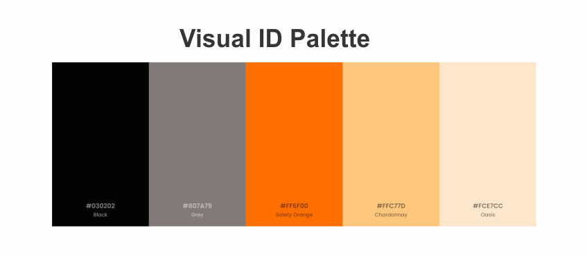
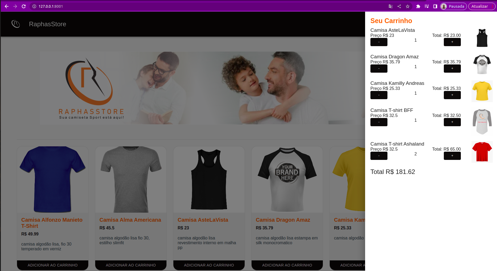
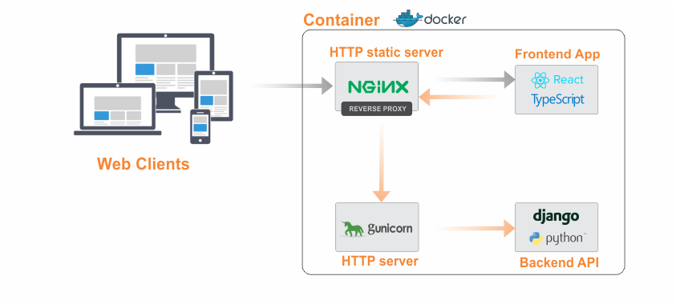
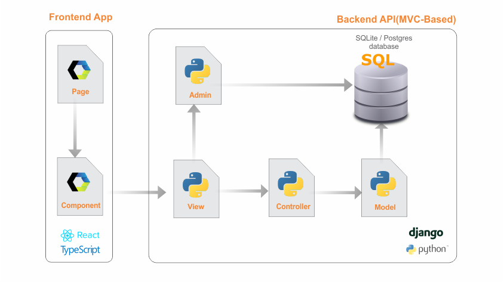
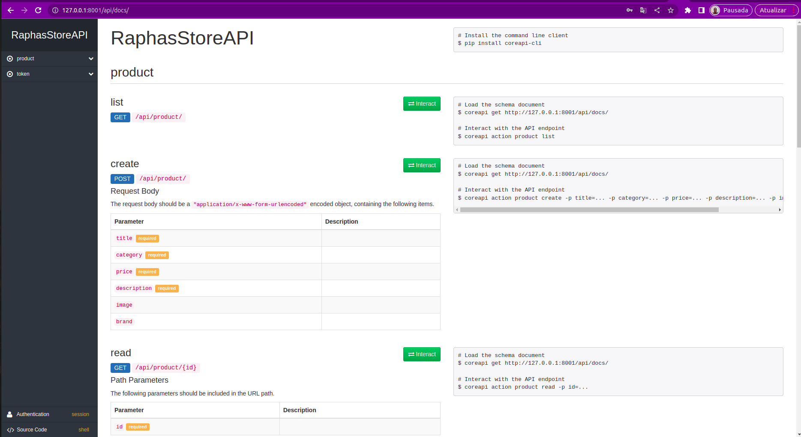

## Quick Start
IMPORTANT: You must install Docker and Docker-Compose before running this project.

1 - Clone this repo.<br>
2 - In terminal go to the root directory<br>
3 - Build the docker image (it will install all dependencies):
```bash
docker-compose build
```
4 - Run full environment (API+Frontend):
```bash
docker-compose up
```

5 - Quick Access
default django user:
<i>username: admin</i>
<i>password: admin</i>

URLs
App Home page: http://127.0.0.1:8001
Django Admin Panel: http://127.0.0.1:8001/admin/
API Documentation: http://127.0.0.1:8001/api/docs/
<b><span style="color: #E65100;">You can use the API documentation to test endipoints perfoming CRUDs requests.</span></b>

## About this Project
This project is part of a challenge proposed by Dafiti company.

##### Challenge Specifications:
• As a business requirement, choose a fashion-related resource. E.g. shoes, pants, shirts, etc…
• Create a RESTful JSON API to expose CRUD (Create/Retrieve/Update/Delete) operations on this resource.
• Create a frontend to the API. You are free to do that server-side, e.g. with Django Admin, or client side with a frontend framework of your
choice.
• Provide a way for us to run your application locally with all of its’ requirements (python and infrastructure-wide). An alternative is to host
it somewhere we can interact with the API and frontend. It would be great to document the steps required to that on the README. ;)
• Optional requirement: Create an endpoint to populate data into the model/table using a CSV file. One of the fields of the model/table
must have its’ value calculated based on 1 or more of the other ones.

##### IMTPORTANT: I had choose shirts as fashion-related resource to work with

## Proposed Solution
The proposed solution is an API is based on the RESTFull standards and a simple web frontend.

#### Brand

Once i have choose the solution domain, second task was create a new brand and visual id to the project.
##### 1. Logo
<p align="center">
  
</p>

##### 2. Color Palette
Our visual id color palette was based on the Google's Material Design.
<p align="center">
  
</p>

### Solution Preview
Frontend is just a simple web application that displays a list of products and has a shopping cart.
<p align="center">
  
</p>

## Applyed technologies
Solution was implemented using the following technologies:

• Python 3.10
• Django 4.1
• Django Rest Framework 3.13.1
• Reactjs 18.2.0
• Material ui 0.21.12
• TypeScript 4.8.2
• Styled-components 5.3.5
• React-router-dom 6.3.0
• Docker 20.10.12
• Docker Compose 2.4.1
• Gunicorn 20.1.0
• CoreAPI 2.3.3

## Solution Architecture
The following figure presents the architecture and data flow within the proposed solution:

<p align="center">
  
</p>

The Ngix serves HTTP statics files of the React app. The gunicorn WSGI serves django API. Due gunicorn can't perform statics files responses, the Ngix was configured as a reverse proxy too, so it can serves django statics files(e.g. Admin templates).


## Application Architecture
The following figure presents the architecture and data flow within the whole proposed application:

<p align="center">
  
</p>

In the frontend side I has implemented a web component based application using React an TypeScript. Backend side has a MVC(Model-Controller-View)-based API using  Python, Django and Django rest-framework.

## API Documentation
All the API documentation is available at: http://127.0.0.1:8001/api/docs/ and was automatically generated by coreapi django extension.

<b><span style="color: #E65100;"> The documentation lets us to interact with the API using HTTP methods so you can test API management live as you running the backend without need a frontend client.<span></b>

#### Documentation Preview
<p align="center">
  
</p>


